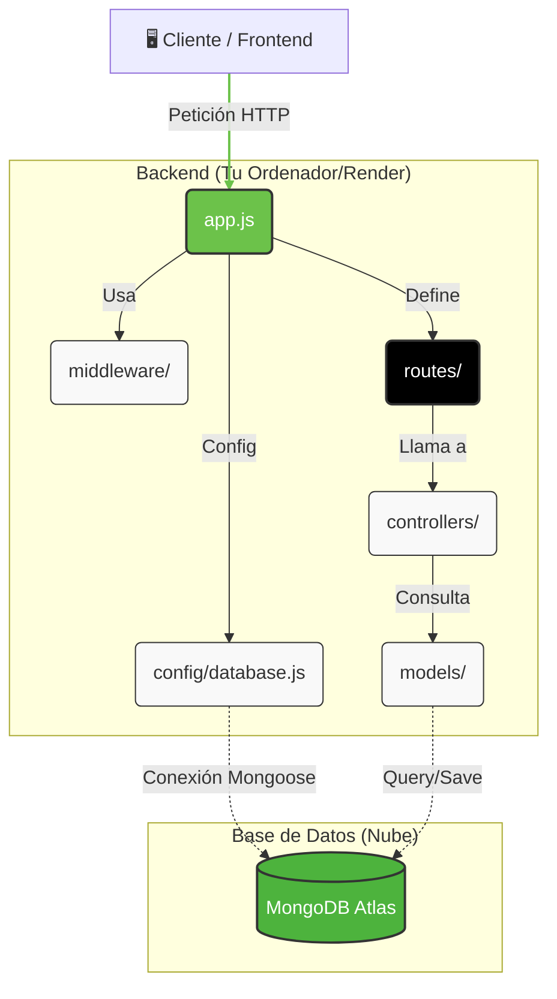
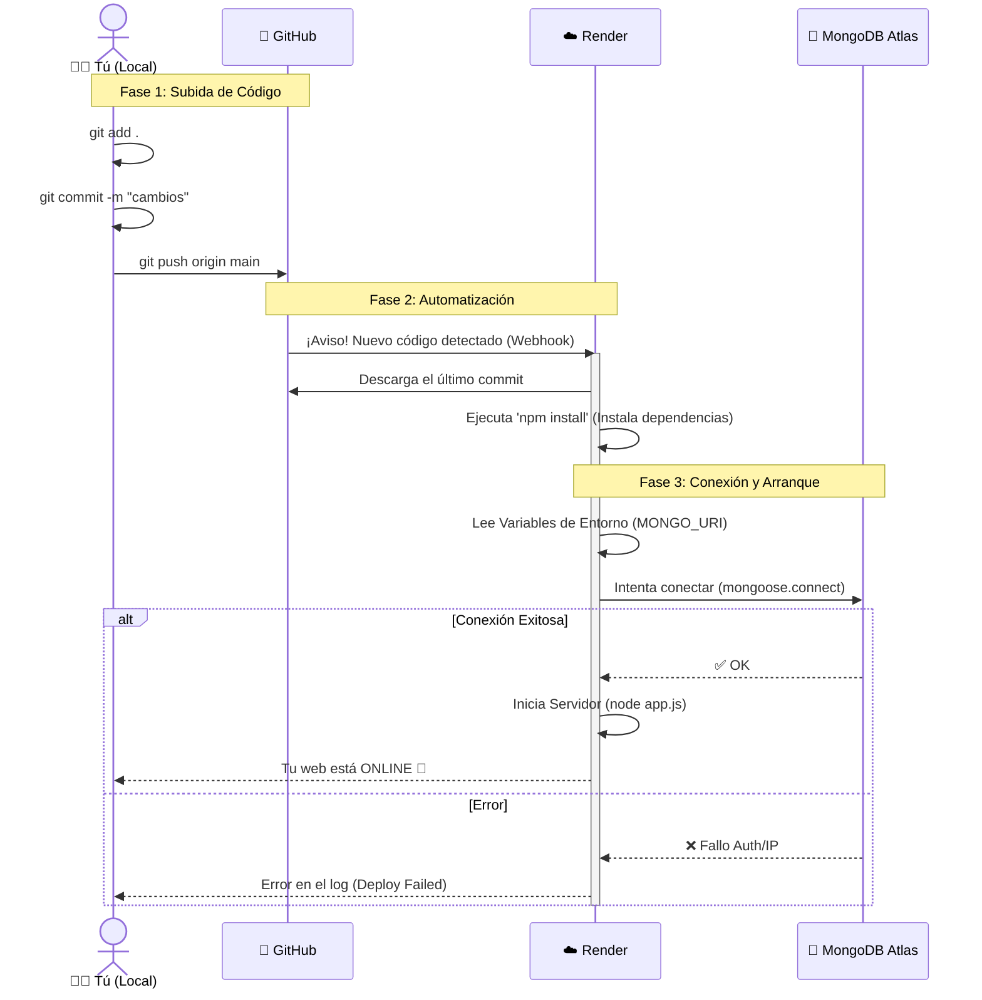
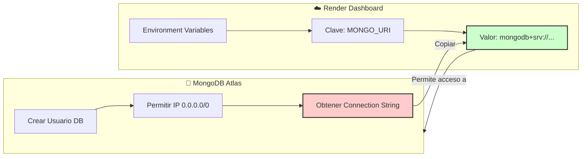

# Arquitectura Visual del Proyecto y Despliegue

Este documento proporciona una visión gráfica y clara de cómo está construido tu backend y cómo fluye la información desde tu entorno local hasta la nube.

## 1. Arquitectura del Proyecto (Node + Express + Mongo)

Este diagrama muestra cómo se relacionan los ficheros en tu carpeta `Desktop/Multimedia/BackBiblioteca`.

### Explicación del Flujo
1.  **Client**: El usuario o frontend hace una petición (ej. Login o Pedir Libros).
2.  **app.js**: Es la puerta de entrada. Configura Express, conecta con la BD y carga las rutas.
3.  **Routes**: Deciden a dónde ir según la URL (ej. `/login` o `/libros`).
4.  **Controllers**: Es el "cerebro". Recibe los datos, piensa qué hacer y responde.
5.  **Models**: Definen la *forma* de los datos (Schema) y hablan directamente con MongoDB Atlas.
6.  **Atlas**: Es donde realmente se guardan los datos en la nube.

---

## 2. Flujo de Despliegue (Deploy) a Render

Este diagrama explica qué pasa "mágicamente" cuando subes tu código.

## 3. Guía Visual de Conexión (Atlas <-> Render)

Para que Render pueda hablar con Atlas, necesitas configurar la **Variable de Entorno**. Es como darle la llave de casa.

### Pasos Clave para la Conexión:

1.  **En Atlas**:
    *   **Network Access**: Añade la IP `0.0.0.0/0` (Significa: "Permitir acceso desde cualquier lugar", necesario porque Render cambia de IP).
    *   **Database Access**: Crea un usuario con contraseña (¡recuérdala!).
    *   **Connect**: Elige "Drivers" y copia la cadena (`mongodb+srv://<usuario>:<password>@cluster...`).

2.  **En Render**:
    *   Ve a tu servicio web -> **Environment**.
    *   Añade una llave llamada `MONGO_URI`.
    *   Pega la cadena de Atlas. **IMPORTANTE**: Cambia `<password>` por tu contraseña real.

### Comandos de Build y Start en Render

Cuando configures el servicio en Render, te pedirá dos comandos clave:

| Campo | Comando | Explicación |
| :--- | :--- | :--- |
| **Build Command** | `npm install` | Instala las librerías que listaste en `package.json` (express, mongoose, etc.). |
| **Start Command** | `node app.js` | Arranca tu servidor usando el archivo principal que vimos antes. |
